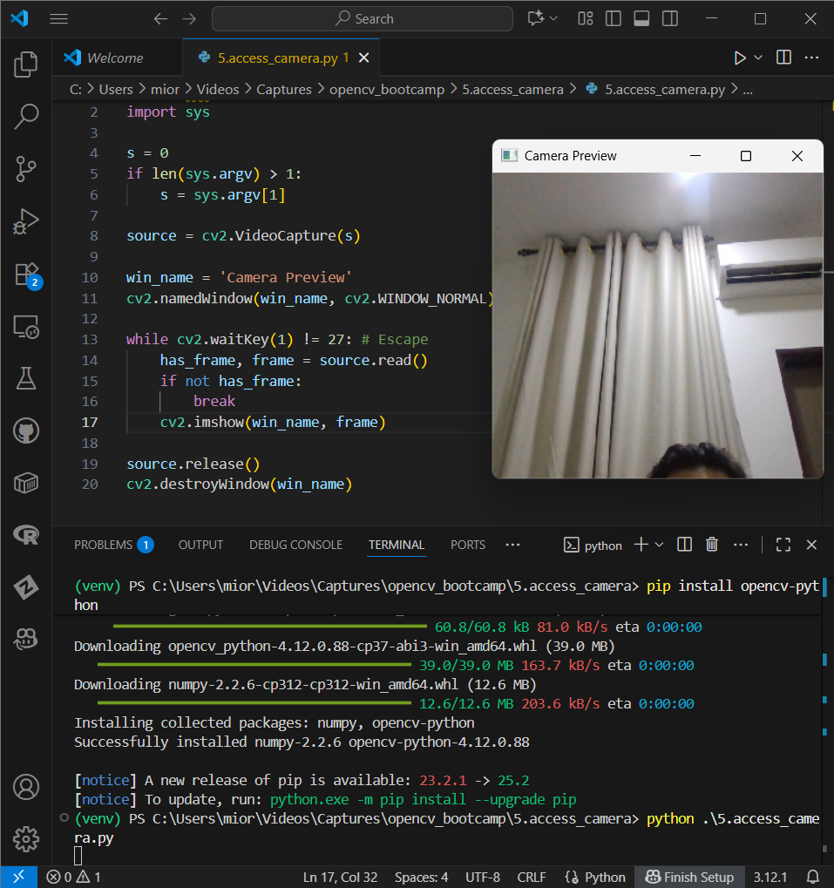

# opencv
opencv : OpenCV #

## Objective
- To leverage OpenCV fundamentals for Computer Vision task
    - Image manipulation
    - Immage Annotation
    - Camera Access
    - Video Writing
    - Image Filter (Edge Detection)
    - Image Alignment
    - Panorama
    - HDR
    - Object Tracking
    - Face Detection
    - Object Detection
    - TF Object Detection
    - OpenPose 

##  OpenCV

